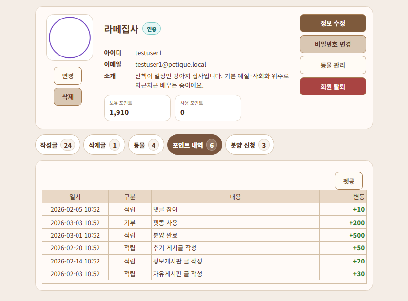
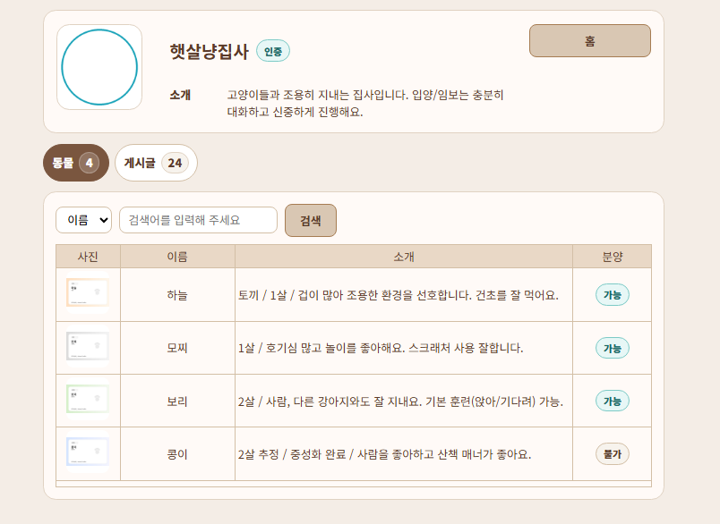
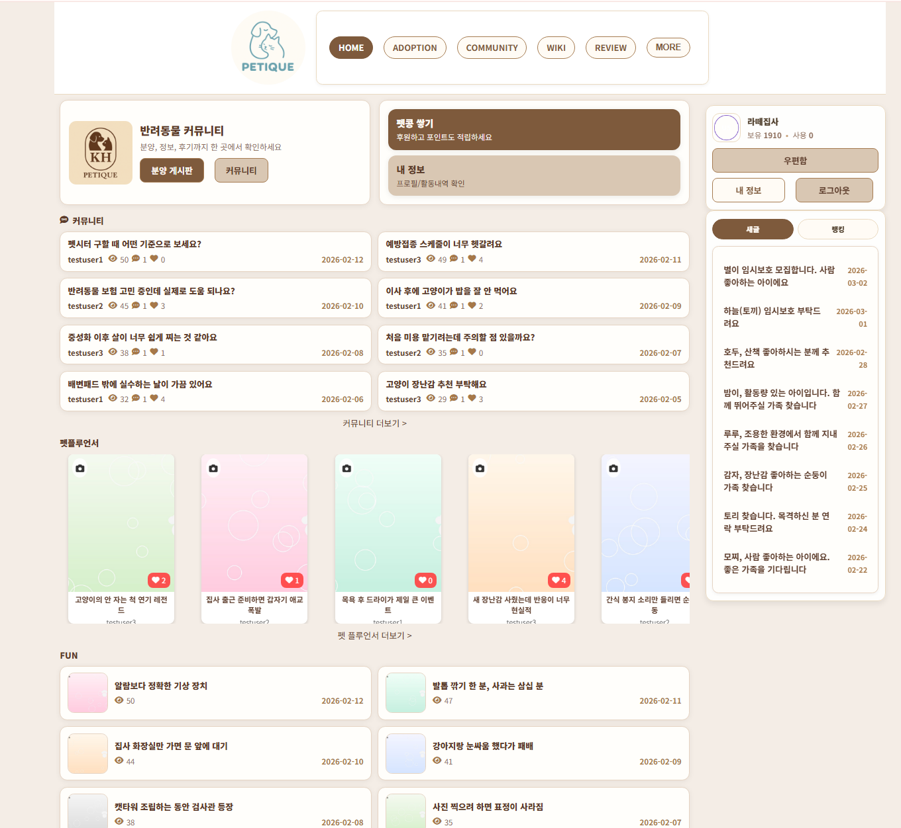

# 🐾 PETIQUE — 분양 프로세스가 있는 반려동물 커뮤니티

게시판을 만드는 일은 생각보다 빨리 끝납니다.  
진짜 오래 걸리는 건 그 다음이었습니다. “신청은 어디에 남기지?”, “승인은 한 명만 가능한가?”, “완료가 되면 동물은 누구 소유가 되는가?” 같은 질문들이요.

PETIQUE는 분양 게시판을 **단순 게시글이 아니라, 상태가 변하는 흐름(프로세스)** 으로 정의했습니다.  
신청/승인/거절/완료가 DB에 기록되고, 그 상태에 맞춰 버튼·권한·화면이 자연스럽게 바뀌도록 구현했습니다.

> 글이 끝이 아니라 **분양이 끝나는 지점까지** 이어지는 게시판

---

## ✅ 핵심 구현

- **분양 신청 기록**: 신청 내용이 `ADOPTION_APPLY`에 남고, 글 기준으로 신청자 목록을 관리
- **승인 1명 원칙**: 작성자는 한 명만 승인할 수 있고, 나머지 대기 신청은 자동 정리(거절 처리)
- **완료 처리(분양 종료)**
  - 승인된 신청을 완료로 전환
  - 동물 소유자(`ANIMAL_MASTER`)를 승인자에게 이전
  - 종료 상태를 고정(`ANIMAL_PERMISSION = 'f'`)해서 리스트/상세에서 즉시 반영
- **상태 기반 UI**: 상세 화면에서 상태에 따라 가능한 동작(신청/취소/승인/거절/완료)이 달라짐
- **분양 리스트 UX**: 상태 탭 + 필터(동물/타입) + 검색/정렬 + 12개 단위 페이지네이션
- **프로필 연결**: 게시글/댓글/리스트에서 작성자 프로필로 바로 이동(관계가 보이게)
- **마이페이지**
  - 내가 신청한 분양 내역
  - 포인트 적립/사용 내역

👉 분양 프로세스의 **핵심 컨트롤러/서비스/DAO/쿼리/트러블슈팅**은 `detail.md`에 정리했습니다.

---

## 🧩 Tech Stack

- Java / Spring MVC
- JSP (JSTL)
- Oracle DB
- JdbcTemplate
- Maven

---

- **알림(Notifications)**: 분양 신청/승인/거절/완료, 후기 작성 시 알림이 저장되고 헤더/마이페이지에서 확인
- **후기 연결(Review Link)**: 분양 완료 후 후기 작성/보기 동선을 제공하고, 분양글 ↔ 후기글을 1:1로 연결

## 🏗 Architecture

| System Architecture |
|---|
|  |

프로젝트는 기본적인 MVC 구조로 구성했습니다.

요청 흐름은  
Controller → Service → DAO → Database 순서로 동작합니다.

분양 승인이나 완료 처리처럼 여러 테이블이 함께 변경되는 작업은  
Service 계층에서 트랜잭션으로 묶어 처리했습니다.

---

## 📊 ERD

| ERD |
|---|
|  |

분양 기능은 아래 3축으로 데이터가 연결됩니다.

- **BOARD**: 분양글(콘텐츠)
- **ANIMAL / BOARD_ANIMAL**: 글-동물 연결 + 소유자/종료 상태
- **ADOPTION_APPLY**: 신청/승인/거절/완료 같은 진행 상태

---

## 🧭 화면 흐름

| 분양 리스트(탭/필터/정렬/페이지네이션) | 분양 상세(모집중) |
|---|---|
|  |  |

| 신청자 관리(승인/거절) | 분양 완료(종료 상태 반영) |
|---|---|
|  |  |

| 분양 완료 후 후기 작성 동선 | 분양 후기 작성 |
|---|---|
|  |  |

| 마이페이지 — 분양 신청 내역 | 마이페이지 — 포인트 내역 |
|---|---|
|  |  |

| 마이페이지 — 알림 | 회원 프로필 |
|---|---|
|  |  |

| 메인 |
|---|
|  |
---

## 📄 문서

- `detail.md` : 분양 프로세스(상태 설계) / 핵심 컨트롤러 매핑 / DAO·쿼리 / 트러블슈팅
