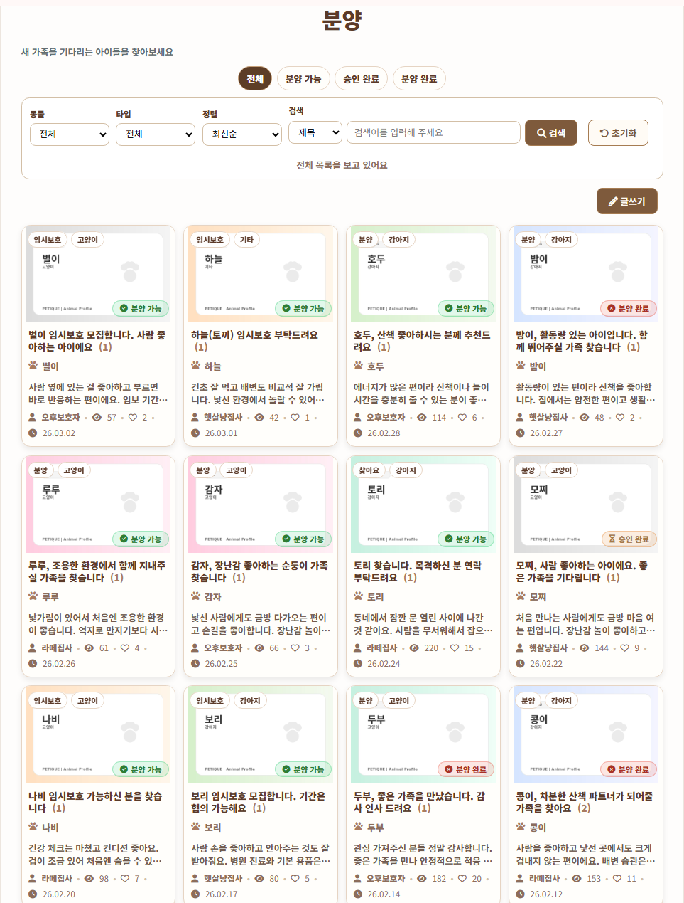
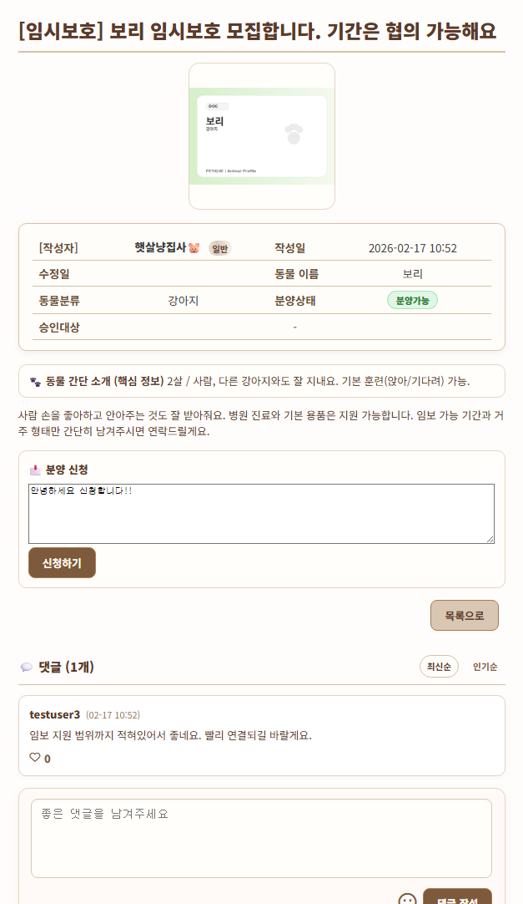
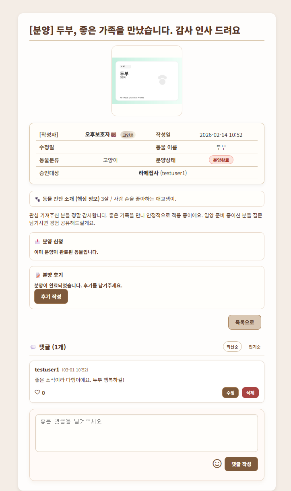
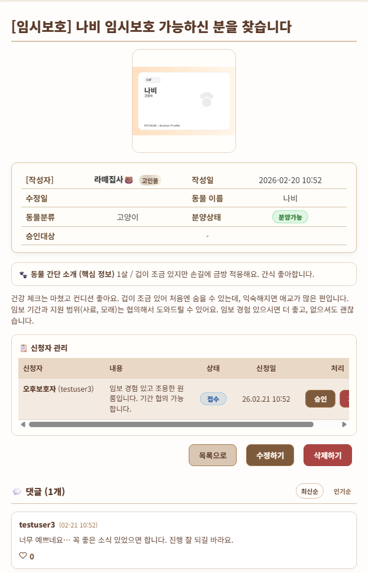
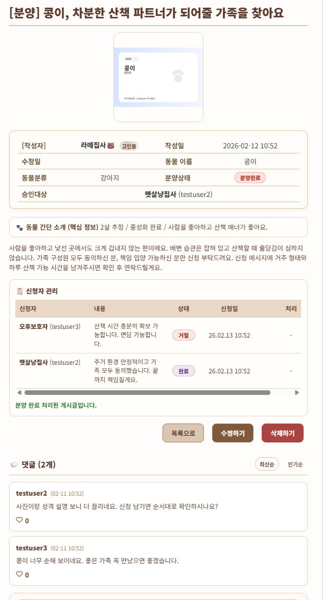
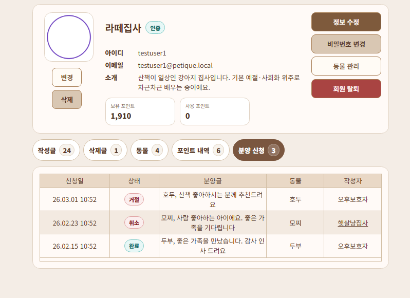
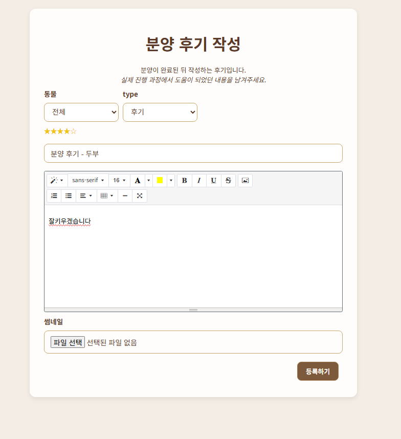
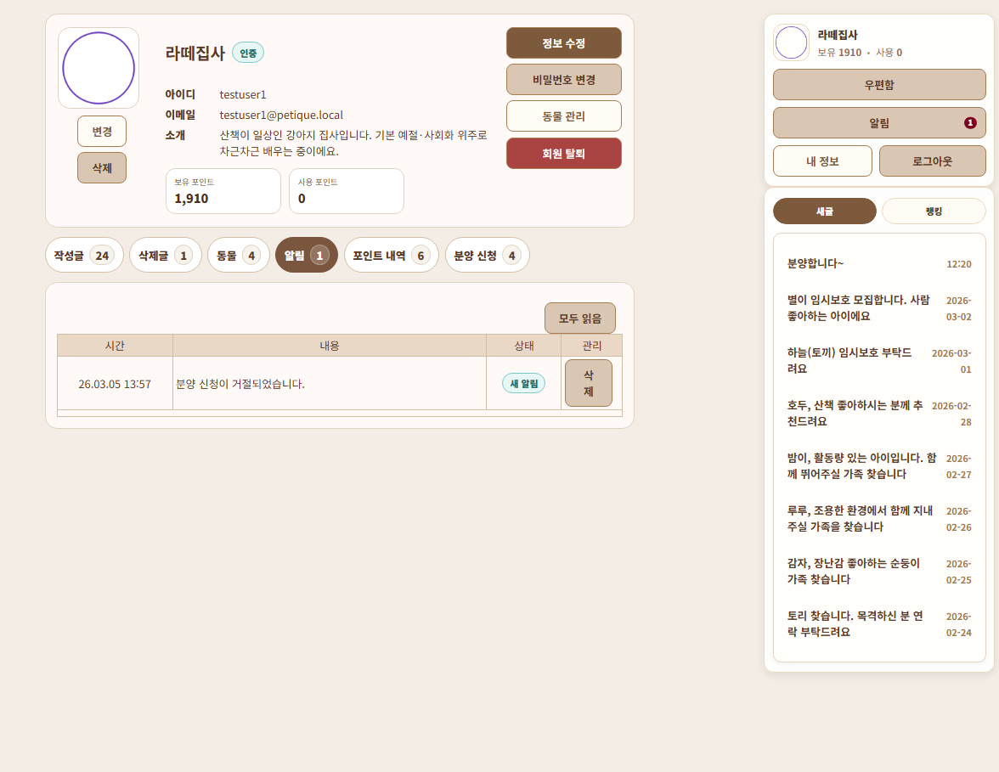

# PETIQUE | 분양 게시판 상세 정리

이 문서는 PETIQUE 전체를 설명하려고 쓴 문서가 아니라, 제가 맡았던 분양 게시판 쪽을 코드 기준으로 다시 정리한 기록입니다. 겉으로 보면 게시글 하나 더 있는 기능처럼 보였지만, 실제로는 신청자가 생기고 한 명만 승인되고, 끝나면 소유자와 상태까지 같이 바뀌어야 해서 일반 게시판처럼 다루기 어려운 파트였습니다.

그래서 분양 기능은 처음부터 “글”보다 “상태가 이어지는 기능”으로 보고 정리했습니다. 리스트, 상세, 신청자 관리, 완료, 후기, 알림까지 같은 기준으로 이어지도록 맞추는 쪽이 이 작업의 중심이었습니다.

---

## 담당 역할

- 분양 게시판 목록 / 상세 화면 구현
- 분양 신청 / 취소 / 승인 / 거절 / 완료 프로세스 설계 및 구현
- 상태 기반 버튼 노출과 권한 처리
- `ADOPTION_APPLY`, `BOARD_ANIMAL`, `ANIMAL` 연동 로직 구성
- 마이페이지 신청 내역, 알림, 후기 작성 동선 연동

---

## 리스트 상태 계산

<table>
<tr>
<td width="48%"></td>
<td valign="top">
분양 리스트는 글 목록처럼 보이지만 카드마다 상태가 먼저 눈에 들어옵니다.<br><br>
- 모집중인지<br>
- 이미 승인자가 있는지<br>
- 완료된 글인지<br><br>
상세 화면에서만 상태를 계산하면 리스트와 쉽게 어긋날 수 있어서, 조회 쿼리에서 상태를 같이 계산해두는 쪽으로 정리했습니다.
</td>
</tr>
</table>

연결 기준
- 컨트롤러에서는 필터, 검색, 정렬, 페이지네이션만 정리
- 실제 상태 계산은 리스트 조회 쿼리에서 함께 처리
- 리스트와 상세가 같은 상태 기준을 보도록 맞춤

### Controller

```java
@GetMapping("/list")
public String list(@ModelAttribute PageFilterVO pageFilterVO, Model model) {
    final int boardType = 4;
    final int pageSize = 12;

    int page = (pageFilterVO.getPage() > 0) ? pageFilterVO.getPage() : 1;
    pageFilterVO.setSize(pageSize);
    pageFilterVO.setBegin((page - 1) * pageSize + 1);
    pageFilterVO.setEnd(page * pageSize);

    List<AdoptDetailVO> boardList = adoptionBoardDao.selectFilterListWithPaging(pageFilterVO, boardType);
    int totalCount = adoptionBoardDao.countFilter(pageFilterVO, boardType);

    model.addAttribute("boardList", boardList);
    pageFilterVO.setDataCount(totalCount);
    model.addAttribute("pageVO", pageFilterVO);
    return "/WEB-INF/views/board/adoption/list.jsp";
}
```

### Query

```sql
case
  when a.animal_permission = 'f' then 'COMPLETED'
  when exists (
      select 1 from adoption_apply aa
      where aa.board_no = b.board_no
        and aa.apply_status in ('APPROVED','COMPLETED')
  ) then 'APPROVED'
  else 'OPEN'
end as adoption_stage
```

이 기준을 쿼리에서 먼저 계산해두니 리스트에서 모집중으로 보이는데 상세에 들어가면 이미 끝난 글처럼 보이는 어색함을 줄일 수 있었습니다.

---

## 상세 버튼 조건

<table>
<tr>
<td width="48%"></td>
<td width="48%"></td>
</tr>
</table>

분양 상세에서는 신청 / 취소 / 승인 / 거절 / 완료 / 후기 버튼까지 조건이 많았습니다. 이걸 JSP 안에서 전부 계산하게 두면 화면이 금방 복잡해질 것 같아서, 컨트롤러에서 먼저 상태와 권한을 정리해 모델에 담는 방식으로 맞췄습니다.

연결 기준
- `AdoptionBoardController.detail()`에서 상태와 권한 계산
- JSP는 계산보다 표시 쪽에 집중
- 후기 작성 가능 여부도 같은 곳에서 함께 정리

### Controller

```java
AdoptionApplyVO approvedApply = adoptionApplyDao.selectApprovedByBoardNo(boardNo);
AdoptionApplyVO completedApply = adoptionApplyDao.selectCompletedByBoardNo(boardNo);

String adoptionStage = "OPEN";
if ("f".equals(adoptDetailVO.getAnimalPermission())) adoptionStage = "COMPLETED";
else if (approvedApply != null) adoptionStage = "APPROVED";

boolean isOwner = loginId != null && loginId.equals(adoptDetailVO.getBoardWriter());
AdoptionApplyVO myApply = loginId != null
        ? adoptionApplyDao.selectLatestByBoardAndApplicant(boardNo, loginId)
        : null;

boolean canApply = loginId != null
        && !isOwner
        && !"COMPLETED".equals(adoptionStage)
        && approvedApply == null
        && (myApply == null
            || "REJECTED".equals(myApply.getApplyStatus())
            || "CANCELLED".equals(myApply.getApplyStatus()));
```

```java
boolean canWriteReview = loginId != null
        && "COMPLETED".equals(adoptionStage)
        && completedApply != null
        && loginId.equals(completedApply.getApplicantId())
        && reviewBoardNo == null;
```

상세 화면에서는 버튼을 숨기는 것보다, 왜 이 버튼이 보여야 하는지를 한 군데에 모아두는 일이 더 중요했습니다. 같은 글이라도 보는 사람이 작성자인지, 신청자인지, 완료된 글인지에 따라 화면이 달라졌기 때문입니다.

---

## 신청 승인과 중복 방지

<table>
<tr>
<td width="100%"></td>
</tr>
</table>

작성자는 상세 화면에서 신청자 목록을 보고 승인 / 거절을 처리합니다. 이 구간은 버튼을 하나만 누르게 하는 것보다, 서버에서 한 번 더 막는 쪽이 더 중요했습니다. 분양은 결국 한 명만 승인돼야 했기 때문입니다.

연결 기준
- 신청 시 자기 글 신청, 완료 글 신청, 중복 신청을 먼저 차단
- 승인 시 작성자 권한과 현재 상태를 다시 확인
- 승인 성공 뒤 나머지 대기 신청은 한 번에 정리

### Service - apply

```java
@Transactional
public boolean apply(int boardNo, String applicantId, String applyContent) {
    AdoptDetailVO detail = adoptionBoardDao.selectAdoptDetail(boardNo);
    if (detail == null) return false;
    if (applicantId == null) return false;
    if (applicantId.equals(detail.getBoardWriter())) return false;
    if ("f".equals(detail.getAnimalPermission())) return false;
    if (adoptionApplyDao.existsApprovedOrCompleted(boardNo)) return false;
    if (adoptionApplyDao.existsActiveByBoardAndApplicant(boardNo, applicantId)) return false;

    AdoptionApplyDto dto = AdoptionApplyDto.builder()
            .applyNo(adoptionApplyDao.sequence())
            .boardNo(boardNo)
            .animalNo(detail.getAnimalNo())
            .applicantId(applicantId)
            .applyContent(applyContent == null || applyContent.isBlank() ? "(신청 내용 없음)" : applyContent.trim())
            .build();
    adoptionApplyDao.insert(dto);
    return true;
}
```

### Service - approve

```java
@Transactional
public boolean approve(int applyNo, String ownerId) {
    AdoptionApplyDto dto = adoptionApplyDao.selectOne(applyNo);
    AdoptDetailVO detail = adoptionBoardDao.selectAdoptDetail(dto.getBoardNo());
    if (!ownerId.equals(detail.getBoardWriter())) return false;
    if ("f".equals(detail.getAnimalPermission())) return false;
    if (adoptionApplyDao.existsApprovedOrCompleted(dto.getBoardNo())) return false;

    boolean ok = adoptionApplyDao.approve(applyNo);
    if (!ok) return false;

    adoptionApplyDao.rejectOthersApplied(dto.getBoardNo(), applyNo);
    return true;
}
```

### Query

```sql
update adoption_apply
set apply_status = 'APPROVED', apply_etime = systimestamp
where apply_no = ? and apply_status = 'APPLIED'
```

```sql
update adoption_apply
set apply_status = 'REJECTED', apply_etime = systimestamp
where board_no = ? and apply_status = 'APPLIED' and apply_no <> ?
```

분양 기능에서 제가 중요하게 본 건 승인 버튼이 있는가가 아니라, 결국 승인자는 한 명만 남는가였습니다. 이 기준이 흔들리면 뒤쪽 완료 처리와 후기 연결까지 전부 같이 흔들릴 수 있었습니다.

---

## 완료 처리와 신청 내역

<table>
<tr>
<td width="48%"></td>
<td width="48%"></td>
</tr>
</table>

완료 처리 뒤에는 화면 상태만 끝난 것으로 보이면 안 됐습니다.

- 신청 상태가 COMPLETED로 바뀌고
- 실제 동물 소유자가 바뀌고
- 분양 종료 permission도 같이 바뀌어야 했습니다.

### Controller

```java
@PostMapping("/completeAdoption")
public String completeAdoption(@RequestParam int boardNo, HttpSession session) {
    String loginId = (String) session.getAttribute("loginId");
    if (loginId == null) return "redirect:/member/login";

    boolean ok = adoptionProcessService.complete(boardNo, loginId);
    return "redirect:detail?boardNo=" + boardNo + (ok ? "&complete=ok" : "&complete=fail");
}
```

### Service

```java
@Transactional
public boolean complete(int boardNo, String ownerId) {
    AdoptDetailVO detail = adoptionBoardDao.selectAdoptDetail(boardNo);
    if (detail == null) return false;
    if (!ownerId.equals(detail.getBoardWriter())) return false;
    if ("f".equals(detail.getAnimalPermission())) return false;

    AdoptionApplyVO approved = adoptionApplyDao.selectApprovedByBoardNo(boardNo);
    if (approved == null) return false;

    boolean completed = adoptionApplyDao.completeApproved(boardNo);
    if (!completed) return false;

    boolean masterUpdated = animalDao.updateMaster(detail.getAnimalNo(), approved.getApplicantId());
    if (!masterUpdated) return false;

    int updated = adoptionBoardDao.updatePermissionToF(boardNo);
    return updated > 0;
}
```

### DAO / Query

```java
public boolean updateMaster(int animalNo, String animalMaster) {
    String sql = "update animal set animal_master = ? where animal_no = ?";
    return jdbcTemplate.update(sql, animalMaster, animalNo) > 0;
}
```

```java
public int updatePermissionToF(int boardNo) {
    String sql =
            "update animal a set a.animal_permission = 'f' " +
            "where a.animal_no = (select ba.animal_no from board_animal ba where ba.board_no = ?)";
    return jdbcTemplate.update(sql, boardNo);
}
```

저는 완료를 상태 문자열 하나 바꾸는 버튼으로 두고 싶지 않았습니다. 실제 소유자 변경까지 이어져야 분양이 정말 끝났다고 볼 수 있다고 생각했습니다.

---

## 후기와 알림 연결

<table>
<tr>
<td width="48%"></td>
<td width="48%"></td>
</tr>
</table>

분양이 끝난 뒤에는 후기 작성과 알림까지 이어져야 사용자가 다음 행동을 찾기 쉬웠습니다.

- 완료된 신청자만 후기 버튼 노출
- 이미 연결된 후기면 중복 작성 방지
- 신청 / 승인 / 거절 / 완료 시 알림 발송

### Controller - review

```java
@GetMapping("/write")
public String writeForm(Model model, HttpSession session,
        @RequestParam(required = false) Integer adoptionBoardNo) {
    String loginId = (String) session.getAttribute("loginId");

    Integer linkedReviewNo = adoptionReviewLinkDao.findReviewBoardNo(adoptionBoardNo);
    if (linkedReviewNo != null) {
        return "redirect:detail?boardNo=" + linkedReviewNo;
    }

    AdoptionApplyVO completedApply = adoptionApplyDao.selectCompletedByBoardNo(adoptionBoardNo);
    if (completedApply == null || !loginId.equals(completedApply.getApplicantId())) {
        throw new NeedPermissionException();
    }
}
```

### DAO

```java
public Integer findReviewBoardNo(int adoptionBoardNo) {
    String sql = "select review_board_no from adoption_review_link where adoption_board_no = ?";
    List<Integer> list = jdbcTemplate.query(sql, (rs, rn) -> rs.getInt("review_board_no"), adoptionBoardNo);
    return list.isEmpty() ? null : list.get(0);
}
```

### Service

```java
public void notify(String memberId, String type, String message, String url) {
    if (memberId == null || memberId.isBlank()) return;
    if (message == null || message.isBlank()) return;

    NotificationDto dto = NotificationDto.builder()
            .notiNo(notificationDao.sequence())
            .memberId(memberId)
            .notiType(type == null ? "INFO" : type)
            .notiMessage(message.trim())
            .notiUrl(url != null && url.trim().startsWith("/") ? url.trim() : null)
            .build();

    notificationDao.insert(dto);
}
```

후기와 알림은 분양이 끝난 뒤 덧붙인 부가 기능처럼 보일 수 있지만, 실제로는 분양이 끝난 다음 사용자가 어디로 이어지는지를 보여주는 마지막 연결이라고 생각했습니다.

---

## 트러블슈팅

### 리스트와 상세가 다른 상태를 보여줄 수 있었습니다
- 문제: 리스트는 모집중인데 상세에 들어가 보면 이미 진행중이나 완료처럼 보일 수 있었습니다.
- 원인: 상태 계산을 한쪽에서만 하면 화면마다 기준이 달라질 수 있었습니다.
- 해결: 리스트 조회 쿼리에서도 `adoption_stage`를 같이 계산하고, 상세 화면도 같은 기준으로 나누도록 맞췄습니다.

### 승인자가 둘 이상 생길 수 있는 지점이 있었습니다
- 문제: 화면에서 버튼을 하나만 누르게 보여줘도 서버 검증이 없으면 예외 상황은 생길 수 있었습니다.
- 원인: UI만 믿고 가면 동시에 승인되거나 이미 바뀐 상태를 다시 건드릴 수 있었습니다.
- 해결: `approve()`에서 `existsApprovedOrCompleted()`를 먼저 확인하고, update도 `apply_status = 'APPLIED'` 조건을 두어 이미 바뀐 상태는 다시 건드리지 않게 했습니다.

### 완료 처리 뒤에도 실제 동물 소유자가 그대로 남을 수 있었습니다
- 문제: 신청 상태만 바뀌고 실제 동물 소유자가 그대로면 화면과 데이터가 어긋나게 됩니다.
- 원인: 완료를 상태 변경으로만 끝내면 실제 분양 결과가 DB에 반영되지 않습니다.
- 해결: `completeApproved()` 뒤에 `animalDao.updateMaster()`와 `updatePermissionToF()`를 같은 트랜잭션 안에 넣었습니다.

### 후기 버튼만 숨겨서는 권한을 막기 어려웠습니다
- 문제: 화면에서 버튼을 숨겨도 직접 URL로 들어오는 경우를 막을 수 없습니다.
- 원인: 버튼 노출과 서버 권한 검사를 같은 것으로 볼 수 없었습니다.
- 해결: 상세 화면에서는 `canWriteReview`로 노출을 제어하고, `ReviewController.writeForm()`과 `write()`에서도 완료된 신청자 여부와 기존 링크 여부를 다시 확인하게 했습니다.

---

## 확인한 시나리오

- 리스트와 상세가 같은 상태를 보여주는지
- 작성자는 자기 글에 직접 신청할 수 없는지
- 한 게시글에서 승인자가 둘 이상 생기지 않는지
- 신청 취소는 `APPLIED` 상태일 때만 되는지
- 완료 후에는 동물 소유자와 permission 값이 같이 바뀌는지
- 완료된 신청자만 후기 버튼을 보는지
- 신청 / 승인 / 거절 / 완료 알림이 맞는 사람에게 가는지

---

## 정리하며

분양 기능은 처음에는 게시판 흐름을 조금 넓히는 일처럼 보였지만, 실제로는 상태와 권한을 끝까지 같이 봐야 하는 작업이었습니다. 이번 파트에서는 화면을 많이 늘리는 것보다, 신청부터 승인, 완료, 후기 연결까지 같은 기준으로 이어지게 만드는 쪽에 더 신경을 썼습니다.
