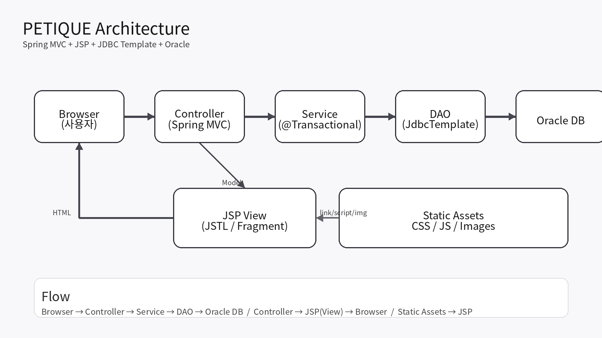
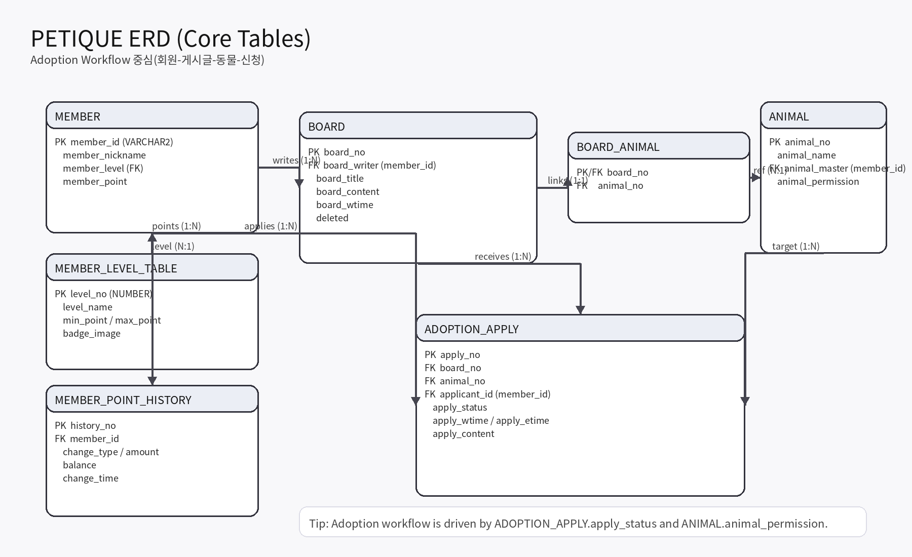

# detail.md — PETIQUE 팀 프로젝트 내 분양 게시판 / 분양 프로세스 구현 기록

이 문서는 PETIQUE 팀 프로젝트에서 제가 담당한 **분양 게시판 기능**을 중심으로,  
설계 배경부터 상태 흐름, 핵심 로직, DAO/쿼리, 트러블슈팅까지 정리한 기술 문서입니다.

PETIQUE는 회원 관리, 게시판/댓글, 쪽지, 포인트, 마이페이지, 반려동물 관리 기능으로 구성된 **반려동물 커뮤니티 서비스**이며,  
본 문서는 그중 **분양 게시판과 분양 상태 관리 영역**에 한정해 설명합니다.

> 핵심은 분양 게시판을 단순 게시글이 아니라 **상태가 변화하는 프로세스**로 구현했다는 점입니다.

---

## 0) 담당 역할

프로젝트 내에서 담당한 범위는 다음과 같습니다.

- 분양 게시판 목록 / 상세 화면 구현
- 분양 신청 / 취소 / 승인 / 거절 / 완료 프로세스 설계 및 구현
- 분양 상태에 따른 버튼 노출 및 권한 처리
- `ADOPTION_APPLY`, `BOARD_ANIMAL`, `ANIMAL` 중심 DB 연동
- 마이페이지 신청 내역, 알림, 후기 동선 등 분양 관련 기능 연계

---

## ERD & Architecture

> `detail.md`는 `docs/` 디렉터리 기준 문서이므로 이미지 경로를 상대 경로로 정리했습니다.





---

## 1) 문제 정의: 분양 기능은 일반 게시판 구조만으로는 부족했다

초기 분양 메뉴를 일반 게시판처럼 구성하면 다음 흐름까지만 처리됩니다.

- 작성자가 글을 등록한다
- 다른 사용자가 글을 조회한다
- 댓글 또는 문의를 남긴다

하지만 실제 분양 흐름은 여기서 끝나지 않습니다.

### 확인한 문제

- **누가 신청했는지 구조화된 기록이 남지 않는다**
- **작성자가 신청자 중 한 명을 선택(승인)할 수 없다**
- **분양 진행 상태와 완료 상태를 시스템이 관리하지 못한다**
- 결과적으로 모든 글이 계속 **모집중**처럼 보일 수 있다

즉, 분양은 단순 게시판 기능이 아니라  
**기록과 상태 전이가 필요한 서비스 흐름**으로 다뤄야 했습니다.

---

## 2) 구현 목표

분양 기능은 다음 기준으로 설계했습니다.

- 신청자가 남긴 신청 내용은 **기록으로 저장**
- 작성자는 신청자 중 **1명만 승인 가능**
- 승인 이후 완료 시
  - 신청 상태가 완료로 변경되고
  - 동물 소유자가 변경되며
  - 분양 종료 상태가 반영되도록 구성
- 화면에서 어떤 버튼을 보여줄지는 **상태 + 권한** 기준으로 결정

여기서 중요한 점은 다음 두 가지였습니다.

1. 프론트에서 버튼을 숨기는 것만으로는 운영 예외를 막기 어렵다  
2. 따라서 서버에서 상태 전이를 검증하고, DB update 조건으로 무결성을 보조해야 한다

즉,  
**프론트는 사용성**, **서버와 DB는 무결성**을 담당하도록 역할을 분리했습니다.

---

## 3) 데이터 모델

### 3-1. `ADOPTION_APPLY` — 분양 상태를 저장하는 중심 테이블

분양 프로세스의 핵심 테이블입니다.  
단순히 “신청이 있었다”를 저장하는 것이 아니라, **신청 상태가 어떻게 변했는지**를 기록합니다.

#### 주요 컬럼
- `board_no` : 대상 분양글 번호
- `animal_no` : 대상 동물 번호
- `applicant_id` : 신청자 ID
- `apply_status` : `APPLIED / APPROVED / REJECTED / CANCELLED / COMPLETED`
- `apply_wtime / apply_etime` : 신청 및 처리 시각

#### `animal_no`를 함께 저장한 이유

분양글은 `BOARD_ANIMAL`을 통해 동물과 연결되지만,  
신청 데이터 역시 **어느 동물을 대상으로 한 신청인지**를 명확하게 가져야 했습니다.

- 글과 동물 연결 정보가 수정되더라도
- 신청 시점의 대상을 안정적으로 추적할 수 있어야 하고
- 운영 중 데이터 정합성을 유지해야 하기 때문입니다.

---

### 3-2. `BOARD_ANIMAL` — 게시글과 동물의 연결

분양글과 동물은 **1:1 연결** 기준으로 단순화했습니다.

- 한 분양글은 한 동물만 다룬다
- 복수 동물을 한 글에서 다루면 신청/승인/완료 기준이 복잡해진다

#### 반영한 운영 규칙
- 글 삭제 시 연결 정보도 함께 삭제 (`ON DELETE CASCADE`)
- 분양 완료 시 동물 `permission`을 `f`로 전환
- 리스트/상세 모두 이 permission 값을 종료 상태 판단 기준으로 활용

---

## 4) 상태 설계 (Workflow)

### 4-1. 상태 정의

- `APPLIED` : 신청 접수
- `APPROVED` : 승인
- `REJECTED` : 거절
- `CANCELLED` : 신청 취소
- `COMPLETED` : 분양 완료

### 4-2. Stage와 Status 분리

DB에는 `apply_status`가 저장되지만,  
화면에서는 게시글 단위의 진행 단계를 더 직관적으로 보여주기 위해 별도 Stage 개념을 두었습니다.

- `OPEN` : 승인된 신청이 없는 상태
- `APPROVED` : 승인된 신청이 존재하는 상태
- `COMPLETED` : 동물 permission이 `f`인 종료 상태

즉,  
- **Status**는 신청 단위 상태
- **Stage**는 게시글/프로세스 단위 상태

로 분리해 UI 표현을 단순화했습니다.

### 4-3. 핵심 규칙

- 한 분양글에서 **승인은 1명만 가능**
- 완료는 **승인 이후에만 가능**
- 승인 / 거절 / 완료는 **작성자만 가능**
- 신청 취소는 **APPLIED 상태일 때만 가능**
- 거절 또는 취소된 사용자는 재신청 가능

이 규칙은 JSP에서만 막지 않고, **서버 로직과 SQL 조건**으로 함께 검증했습니다.

---

## 5) URL / 매핑

### 5-1. `AdoptionBoardController`

파일: `semi/src/main/java/com/spring/semi/controller/AdoptionBoardController.java`

| Method | URL | 설명 |
|---|---|---|
| GET | `/board/adoption/list` | 상태 탭 / 필터 / 검색 / 정렬 / 12개 페이지네이션 |
| GET | `/board/adoption/detail?boardNo=` | 상세 조회 + 분양 프로세스 UI |
| POST | `/board/adoption/apply` | 신청 (`APPLIED`) |
| POST | `/board/adoption/cancel` | 신청 취소 (`CANCELLED`) |
| POST | `/board/adoption/approve` | 승인 (`APPROVED`) |
| POST | `/board/adoption/reject` | 거절 (`REJECTED`) |
| POST | `/board/adoption/completeAdoption` | 완료 (`COMPLETED`) |

POST 요청은 처리 후 상세 페이지로 redirect 하도록 구성해  
새로고침으로 인한 중복 제출을 줄이도록 했습니다(PRG 패턴).

---

## 6) 핵심 구현

### 6-1. 상세 화면에서 사용할 기준값을 컨트롤러에서 먼저 정리

분양 상세에서는 상태와 권한에 따라 노출되는 버튼이 달라집니다.

- 신청 / 취소
- 승인 / 거절 / 완료
- 완료 이후 후기 작성 / 보기

이 조건을 JSP에 직접 분산시키면 유지보수가 어려워지기 때문에,  
컨트롤러에서 먼저 기준값을 계산한 뒤 JSP는 이를 표시만 하도록 정리했습니다.

- `adoptionStage` : `OPEN / APPROVED / COMPLETED`
- `isOwner` : 작성자 여부
- `myApply` : 로그인 사용자의 최근 신청 정보
- `canApply`, `canCancel` : 버튼 노출 여부

발췌 (`AdoptionBoardController.detail`):

```java
AdoptionApplyVO approvedApply = adoptionApplyDao.selectApprovedByBoardNo(boardNo);

String adoptionStage = "OPEN";
if ("f".equals(adoptDetailVO.getAnimalPermission())) adoptionStage = "COMPLETED";
else if (approvedApply != null) adoptionStage = "APPROVED";

boolean isOwner = loginId != null && loginId.equals(adoptDetailVO.getBoardWriter());

AdoptionApplyVO myApply = null;
if (loginId != null) {
    myApply = adoptionApplyDao.selectLatestByBoardAndApplicant(boardNo, loginId);
}

boolean canApply = loginId != null
        && !isOwner
        && !"COMPLETED".equals(adoptionStage)
        && approvedApply == null
        && (myApply == null
            || "REJECTED".equals(myApply.getApplyStatus())
            || "CANCELLED".equals(myApply.getApplyStatus()));

boolean canCancel = loginId != null
        && myApply != null
        && "APPLIED".equals(myApply.getApplyStatus());
```

#### 정리 효과
- JSP의 조건 분기를 줄일 수 있음
- 상태 판단 기준을 한 곳에서 관리 가능
- 디버깅 시 버튼 노출 기준을 빠르게 추적 가능

---

### 6-2. 상태 전이는 Service 계층에서 트랜잭션으로 처리

파일: `semi/src/main/java/com/spring/semi/service/AdoptionProcessService.java`

분양 승인과 완료는 단일 update로 끝나지 않습니다.

- 승인: 한 명 승인 + 나머지 대기 신청 정리
- 완료: 신청 상태 완료 + 동물 소유자 변경 + 분양 종료 처리

이 과정 중 하나라도 실패하면 데이터가 어긋날 수 있기 때문에,  
서비스 계층에서 `@Transactional`로 묶어 처리했습니다.

#### 승인 처리 — 승인 1명 원칙

```java
@Transactional
public boolean approve(int applyNo, String ownerId) {
    AdoptionApplyDto dto = adoptionApplyDao.selectOne(applyNo);
    AdoptDetailVO detail = adoptionBoardDao.selectAdoptDetail(dto.getBoardNo());

    // 1) 권한 검증: 작성자만 승인 가능
    if (!ownerId.equals(detail.getBoardWriter())) return false;

    // 2) 한 게시글에서 승인/완료 상태는 1명만 허용
    if (adoptionApplyDao.existsApprovedOrCompleted(dto.getBoardNo())) return false;

    // 3) APPLIED 상태일 때만 APPROVED로 변경
    boolean ok = adoptionApplyDao.approve(applyNo);
    if (!ok) return false;

    // 4) 나머지 대기 신청 자동 거절
    adoptionApplyDao.rejectOthersApplied(dto.getBoardNo(), applyNo);
    return true;
}
```

#### 완료 처리 — 상태 완료 + 소유자 이전 + 종료 반영

```java
@Transactional
public boolean complete(int boardNo, String ownerId) {
    AdoptDetailVO detail = adoptionBoardDao.selectAdoptDetail(boardNo);

    // 1) 권한 검증
    if (!ownerId.equals(detail.getBoardWriter())) return false;

    // 2) 승인된 신청이 있어야 완료 가능
    AdoptionApplyVO approved = adoptionApplyDao.selectApprovedByBoardNo(boardNo);
    if (approved == null) return false;

    // 3) 승인 상태를 완료로 변경
    boolean completed = adoptionApplyDao.completeApproved(boardNo);
    if (!completed) return false;

    // 4) 동물 소유자 변경
    boolean masterUpdated = animalDao.updateMaster(detail.getAnimalNo(), approved.getApplicantId());
    if (!masterUpdated) return false;

    // 5) 분양 종료 처리
    int updated = adoptionBoardDao.updatePermissionToF(boardNo);
    return updated > 0;
}
```

완료 로직은  
**검증 → 신청 완료 처리 → 소유자 변경 → 종료 반영**  
순서를 유지해 디버깅과 롤백 추적이 쉽도록 구성했습니다.

---

### 6-3. 핵심 쿼리

#### 승인 / 거절 / 완료 update

파일: `semi/src/main/java/com/spring/semi/dao/AdoptionApplyDao.java`

UI에서 버튼을 막더라도 중복 클릭, 동시 요청, 우회 요청은 발생할 수 있기 때문에  
SQL에서도 상태 조건을 함께 걸어두었습니다.

**승인 (`APPLIED → APPROVED`)**

```sql
update adoption_apply
set apply_status = 'APPROVED', apply_etime = systimestamp
where apply_no = ? and apply_status = 'APPLIED';
```

**나머지 자동 거절 (`APPLIED → REJECTED`)**

```sql
update adoption_apply
set apply_status = 'REJECTED', apply_etime = systimestamp
where board_no = ? and apply_status = 'APPLIED' and apply_no <> ?;
```

**완료 (`APPROVED → COMPLETED`)**

```sql
update adoption_apply
set apply_status = 'COMPLETED', apply_etime = systimestamp
where board_no = ? and apply_status = 'APPROVED';
```

이렇게 구성하면 이미 처리된 요청은 다시 처리되지 않도록 제어할 수 있습니다.

---

#### 리스트에서 상태를 함께 계산

파일: `semi/src/main/java/com/spring/semi/dao/AdoptionBoardDao.java`

리스트에서 상태 뱃지를 보여주기 위해 글마다 상태를 개별 조회하면 비효율적이므로,  
조회 쿼리에서 `adoption_stage`를 함께 계산하도록 정리했습니다.

```sql
case
  when a.animal_permission = 'f' then 'COMPLETED'
  when exists (
      select 1 from adoption_apply aa
      where aa.board_no = b.board_no
        and aa.apply_status in ('APPROVED','COMPLETED')
  ) then 'APPROVED'
  else 'OPEN'
end as adoption_stage
```

이 기준을 리스트와 상세 모두 동일하게 적용해  
화면마다 다른 상태가 보이는 문제를 줄였습니다.

---

## 7) 페이지네이션과 UI 기준

분양 리스트는 카드형 UI 기준으로 **12개 고정**이 가장 안정적이어서 페이지 크기를 그렇게 맞췄습니다.

```java
int begin = (page - 1) * pageSize + 1;
int end = page * pageSize;
```

또한 리스트 화면에서는 다음 요소를 함께 제공했습니다.

- 동물 분류 / 게시판 타입 필터
- 검색 기능
- 최신순 / 조회순 정렬
- 진행 상태 표시

---

## 8) 분양 관련 연동 기능

분양 프로세스는 상태 전이만 구현해도 동작하지만,  
사용자가 다음 행동으로 자연스럽게 이어질 수 있도록 주변 기능도 연결했습니다.

### 8-1. 알림 기능
- 분양 신청 발생 시 작성자에게 알림
- 승인 / 거절 / 완료 시 신청자에게 알림
- 헤더 및 마이페이지에서 확인 가능

실시간 웹소켓 방식 대신 **DB 저장형 알림**으로 구성해  
미접속 상태에서도 나중에 알림을 확인할 수 있도록 했습니다.

### 8-2. 후기 연결
- 분양 완료 이후 후기 작성 버튼 제공
- 이미 작성된 경우 후기 보기 버튼 제공
- 분양글과 후기글을 1:1로 연결해 완료 이후 흐름이 이어지도록 구성

---

## 9) 트러블슈팅

### 9-1. 승인자가 여러 명이 될 수 있는 문제

**상황**  
중복 클릭이나 동시 요청이 들어오면 한 게시글에서 여러 명이 승인될 수 있는 위험이 있었습니다.

**해결**
- 승인 전 승인/완료 상태 존재 여부 검사
- `APPLIED` 상태일 때만 승인 update
- 승인 성공 시 나머지 대기 신청 자동 거절

---

### 9-2. 완료 처리 중 데이터 불일치 문제

**상황**  
완료 처리에는 다음 작업이 함께 필요합니다.

- 신청 상태 완료
- 동물 소유자 변경
- 분양 종료 반영

개별 실행 시 중간 실패로 데이터가 불일치할 수 있었습니다.

**해결**
- 서비스 계층에 완료 로직 집중
- `@Transactional`로 묶어 원자성 확보

---

### 9-3. 화면별 상태 판단 기준 불일치

**상황**  
리스트와 상세가 서로 다른 기준으로 상태를 판단하면  
같은 글이 모집중 또는 진행중으로 다르게 보일 수 있었습니다.

**해결**
- 승인 신청 존재 여부 + 동물 permission 값을 공통 기준으로 사용
- 리스트 조회와 상세 화면 모두 동일한 Stage 판단 로직 적용

---

## 10) 정리

이번 담당 기능을 구현하면서,  
분양 게시판은 단순한 게시글 CRUD가 아니라 **상태, 권한, 데이터 무결성**이 함께 움직여야 하는 기능이라는 점을 확인할 수 있었습니다.

특히 다음 세 가지가 핵심이었습니다.

- 신청 이력을 구조화된 데이터로 남기는 것
- 승인/완료 상태를 서버와 DB 기준으로 일관되게 관리하는 것
- 완료 이후 알림과 후기 작성까지 자연스럽게 이어지도록 연결하는 것

이 문서는 팀 프로젝트 전체가 아니라,  
그중 제가 맡은 **분양 게시판 / 분양 프로세스 구현 영역**을 정리한 문서입니다.
